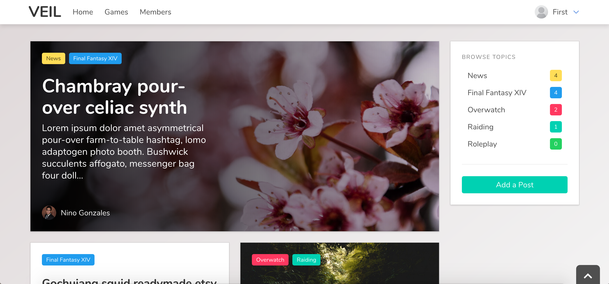

# Veil: GuildHub
Website for Veil, a guild and gaming community

>Currently a work in progress! Will be completely remade using React and Redux along with an Express.js backend and PostgreSQL database.

#### Why did I decide to do this?
- A lot of guild website builders are ugly, outdated, not responsive
- Difficult to communicate for bigger guilds
- One place for everything

#### What is this exactly?
- A hub for gaming communities containing guild information, announcements, events, blog posts, etc.

#### How did I build this?
- I built this with HTML5, CSS3, and Sass using the [Bulma](http://bulma.io) framework, along with JavaScript, jQuery, AJAX, and Axios for the front-end. I deployed my front-end with Surge. I used Node.js, Express.js, Knex.js, and PostgreSQL for the back-end. I deployed my back-end with Heroku.

#### What's next?
- Roles & permissions
- Event calendar
- Integrate with games and Discord
- Forum/message board

## Could I take a peek?

For now, a current working version is available [here](http://veil.surge.sh).

## What can I do right now?
- You can view posts, filter through posts with tags, and view each post in detail.
- You can view a list of games, each game in detail, and which members play each game.
- You can view a list of members and each member in detail, along with what games each member plays and what characters each member has for each game they play.
- You can sign up for an account and log in.
- If you are logged in, you can create a post and edit/delete your own post.

## Bugs
- The site is not responsive (yet).
- The 'Edit Profile' page is currently static.
- Selecting tags when making a post does not add the tags to the post yet.

## Copyright

Copyright &copy; 2018 Vikanda Gonzales. Made with [Bulma](http://bulma.io).
